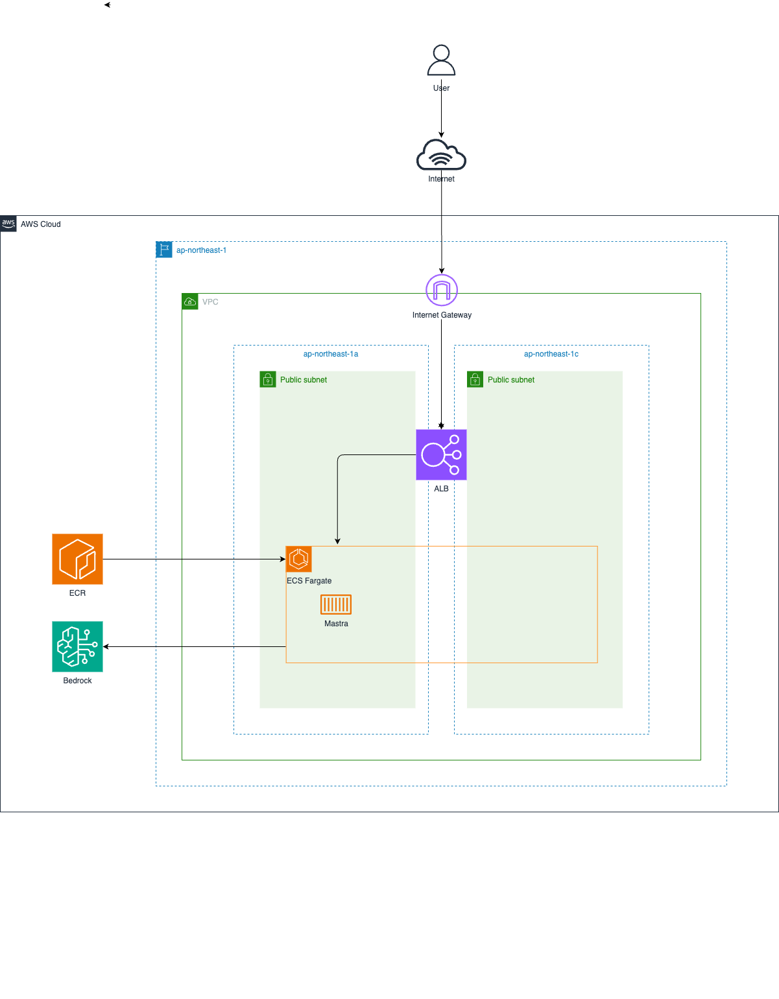

# Mastra MCP with ECS & Bedrock

A CDK project for running Mastra Agent with ECS and Bedrock to interact with MCP Server.  
As an example, this project uses [Playwright MCP server](https://github.com/microsoft/playwright-mcp).

## Prerequisites

- Node.js: v20 or higher
- AWS CDK: v2 or higher
- Docker: v20 or higher
- AWS Credentials: Access Key / Secret Key / Session Token

# Architecture



## Project Structure

```
.
├── app/                    # Application root directory
│   ├── src/               # Application source code
│   │   └── mastra/        # Mastra application root directory
│   │       ├── index.ts   # Mastra instance configuration
│   │       ├── agents/    # Agent definitions
│   │       └── mcp/       # MCP configuration
│   ├── .env.development   # Environment variables for development
│   ├── Dockerfile         # Container image definition
│   ├── package.json       # Application dependencies
│   └── tsconfig.json      # TypeScript configuration for app
├── infra/                 # Infrastructure as Code directory
│   ├── bin/              # CDK application entry point
│   ├── lib/              # CDK stack definitions
│   ├── test/             # Infrastructure test files
│   ├── cdk.json          # CDK configuration
│   ├── package.json      # Infrastructure dependencies
│   └── tsconfig.json     # TypeScript configuration for infra
├── image/                 # Architecture diagrams and images
├── package.json          # Root project dependencies
└── tsconfig.json         # Root TypeScript configuration
```

## Environment Variables

The following environment variables need to be set in the .env.development file.

|Name|Description|
|---|---|
| REGION | Region of AWS. Default is "us-east-1" |
| BEDROCK_MODEL | Model id of Amazon Bedrock. Bedrock model must be enabled in AWS Console beforehand. Default is "amazon.nova-pro-v1:0". |
| ACCESS_KEY_ID | Access key id of AWS. Required only for local development. |
| SECRET_ACCESS_KEY | Secret Access Key of AWS. Required only for local development. |
| SESSION_TOKEN | Session Token of AWS. Required only for local development. |

## Getting Started

All commands should be executed at the repository root.

First, install dependencies for the root project.

```bash
npm ci
```

Next, set up environment variables by creating .env.development file.

```bash
cat << EOF > app/.env.development
REGION=us-east-1
BEDROCK_MODEL=amazon.nova-pro-v1:0
ACCESS_KEY_ID=XXXXXXXXXXXXXXXXXXXX
SECRET_ACCESS_KEY=XXXXXXXXXXXXXXXXXXXX
SESSION_TOKEN=XXXXXXXXXXXXXXXXXXXX
EOF
```

To start local development server, run the following command.

```bash
npm run mastra:dev
```

If you've never used CDK before, you need to [Bootstrap](https://docs.aws.amazon.com/ja_jp/cdk/v2/guide/bootstrapping.html) for the first time only. The following command is unnecessary if your environment is already bootstrapped.

```
npx -w infra cdk bootstrap
```

To deploy the application to AWS, run the following command.

```bash
npm run cdk:deploy
```

To remove the application from AWS, run the following command.

```bash
npm run cdk:destroy
```
